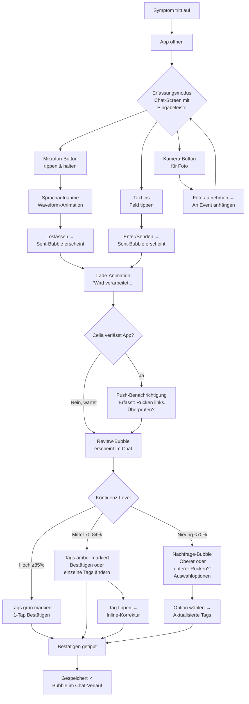
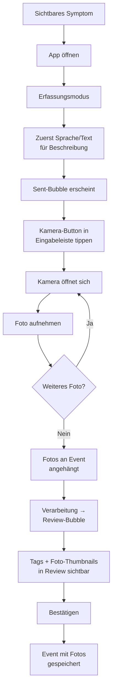
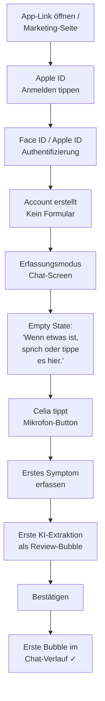
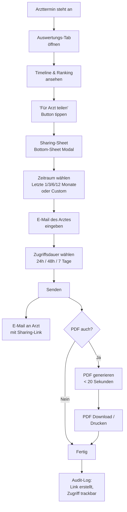
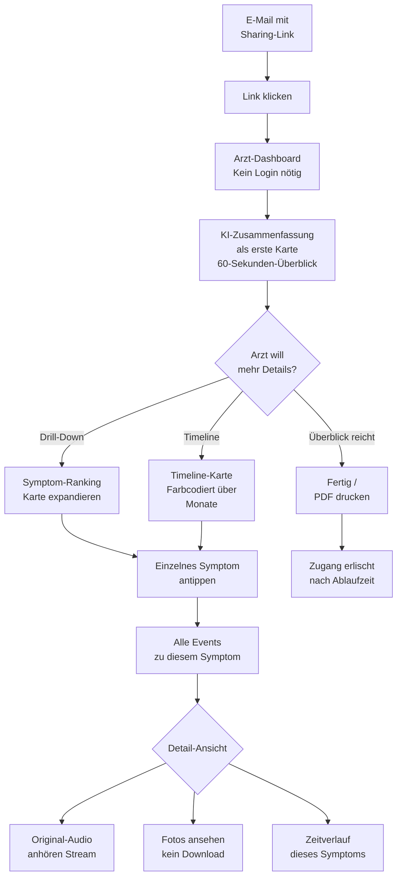
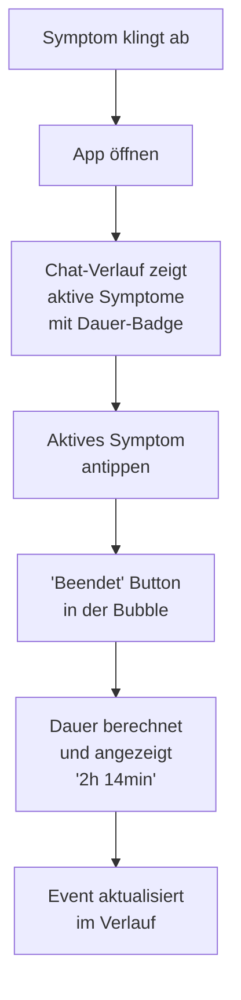

# UX Design Specification lds-symptome-tracker

**Author:** Andy
**Date:** 2026-03-01

---

<!-- UX design content will be appended sequentially through collaborative workflow steps -->

## Executive Summary

### Project Vision

Der LDS Symptom Tracker ist eine ereignisbasierte Web-App mit zwei radikal unterschiedlichen Nutzungsmodi: Ein ultra-schneller Erfassungsmodus (Sprache/Text/Foto, <10 Sekunden) und ein informationsreicher Auswertungsmodus (Dashboard, Timeline, Drill-Down). Die UX-Herausforderung liegt in der Vereinigung dieser gegensätzlichen Anforderungen — Minimalismus bei der Erfassung, Informationstiefe bei der Auswertung — in einer kohärenten Produkterfahrung.

Das Anti-Tagebuch-Prinzip definiert die UX-Philosophie: Event-basiert statt pflichtbasiert. Keine Eingabe = guter Tag. Die App meldet sich nicht proaktiv — der Patient kommt, wenn etwas ist.

### Target Users

**Celia (17, LDS-Patientin) — Primäre Nutzerin**
- Gerät: iPhone (primär), Desktop (sekundär für Auswertung)
- Kontext: Erfasst spontan — abends auf dem Sofa (Sprache), im Unterricht (Text), unterwegs
- UX-Erwartung: So schnell und beiläufig wie eine WhatsApp-Sprachnachricht. Kein medizinisches UI-Gefühl
- Kritischer Moment: Push-Benachrichtigung → Review → Bestätigung/Korrektur muss in 1-2 Taps erledigt sein
- Emotional: Der "Aha-Moment" nach 3 Monaten — Muster entdecken, die ihr nicht bewusst waren

**Arzt/Spezialist — Konsument (kein aktiver Nutzer)**
- Geräte: iPad (Sprechstunde, gemeinsam mit Patientin), Desktop/Chrome (Vorbereitung, 5 Min)
- Kontext: Klickt Sharing-Link, braucht in 60 Sekunden Überblick, taucht bei Bedarf in Drill-Down ein
- UX-Erwartung: Null Einarbeitung. Klinische Klarheit. Sofortige Orientierung ohne Erklärung
- Kritischer Moment: KI-Zusammenfassung muss den Einstieg liefern — danach selbstgesteuerte Exploration
- Doppelnutzung: Allein am Desktop (Vorbereitung) UND gemeinsam mit Patientin auf iPad (Sprechstunde)

### Key Design Challenges

1. **Zwei-Modi-Architektur:** Erfassungsmodus (Speed, Minimalismus, mobile-first) vs. Auswertungsmodus (Informationstiefe, Exploration, responsive). Klare Trennung nötig — der Erfassungsmodus darf nicht durch Dashboard-Elemente verlangsamt werden. Gleichzeitig muss der Wechsel zwischen Modi natürlich sein.

2. **Asynchroner KI-Interaktions-Loop:** Erfassung (8s) → Verarbeitung (bis 10s) → Push-Benachrichtigung → Review → Bestätigung/Korrektur. Der Patient verlässt die App nach der Erfassung und kehrt per Push zurück. Die Korrektur-UI muss gleichzeitig einfach (1-Tap-Bestätigung) und mächtig (Symptomdetails ändern) sein.

3. **Drei-Geräte-Arzt-Ansicht:** Das Arzt-Dashboard muss auf iPhone, iPad und Desktop ohne Anpassung funktionieren. Der Arzt wählt nicht — er nimmt was da ist. Besonders die gemeinsame Nutzung auf dem iPad (Arzt + Patientin gleichzeitig) ist eine seltene UX-Anforderung.

4. **Null-Onboarding-Zwang:** Sowohl für die Patientin (Apple ID → sofort erstes Symptom) als auch für den Arzt (Link klicken → sofort KI-Zusammenfassung). Kein Tutorial, kein Wizard, kein "Lerne die App kennen".

### Design Opportunities

1. **Aha-Moment inszenieren:** Die App zeigt nach Monaten Muster, die der Patient nicht kannte. Dieser emotionale Höhepunkt muss UX-seitig gestaltet werden — nicht als trockene Statistik, sondern als persönliche Entdeckung.

2. **Gemeinsame Konsultations-Erfahrung:** Arzt und Patientin am iPad — eine UX, die für zwei Perspektiven gleichzeitig funktioniert. Chance für ein einzigartiges Interaktionsmodell, das in keiner bestehenden Health-App existiert.

3. **Anti-Tagebuch als UX-Prinzip:** Stille ist ein Feature. Leerer Zustand = guter Tag. Das erfordert ein radikales Umdenken bei Empty States, Notifications und Engagement-Patterns. Keine Gamification, keine Streaks, kein Schuldgefühl.

## Core User Experience

### Defining Experience

Die definierende Interaktion des LDS Symptom Trackers ist die **8-Sekunden-Spracherfassung**: App öffnen → Mikrofon-Button tippen → frei sprechen → fertig. Alles andere — KI-Extraktion, Strukturierung, Push-Benachrichtigung — passiert im Hintergrund. Der Patient investiert 8 Sekunden, das System liefert strukturierte medizinische Daten.

Diese Interaktion muss so natürlich sein wie eine Sprachnachricht senden. Kein Formular, kein Menü, kein Nachdenken. Der Mikrofon-Button ist das erste und wichtigste UI-Element — er definiert das Produkt visuell und funktional.

**Core Loop:**
1. Symptom tritt auf → Patient öffnet App (<3s bis Mikrofon bereit)
2. Spricht/tippt Symptom (8s) → "Wird verarbeitet..."
3. Patient verlässt App → KI arbeitet im Hintergrund
4. Push-Benachrichtigung: "Erfasst: [Extraktion]. Bitte überprüfen."
5. Patient tippt Push → Review-Screen → Bestätigen (1 Tap) oder Korrigieren
6. Event gespeichert → Timeline wächst still über Wochen und Monate

### Platform Strategy

**Primäre Plattform:** Progressive Web App (PWA), mobile-first

| Plattform | Nutzer | Modus | Priorität |
|-----------|--------|-------|-----------|
| iPhone (Safari) | Celia | Erfassung (Sprache, Text, Foto) | Primär |
| iPhone (Safari) | Celia | Auswertung (Feed, Timeline) | Sekundär |
| iPad (Safari) | Arzt | Konsultation (Dashboard, Drill-Down) | Primär |
| Desktop (Chrome) | Arzt | Vorbereitung (Dashboard, PDF) | Primär |
| Desktop (Chrome/Edge) | Celia | Auswertung (Timeline, Ranking) | Sekundär |

**PWA-Capabilities genutzt:**
- MediaRecorder API → Sprach-Erfassung
- Camera API → Foto-Dokumentation
- Web Push API → KI-Ergebnis-Benachrichtigung
- Kein Offline-Modus im MVP (KI-Verarbeitung server-basiert)

**Touch vs. Pointer:**
- Erfassungsmodus: 100% touch-optimiert (grosse Tap-Targets, Swipe-Gesten)
- Auswertungsmodus: Touch + Pointer (responsive, funktioniert auf allen Geräten)
- Arzt-Dashboard: Pointer-freundlich (Desktop-Vorbereitung) UND touch-freundlich (iPad-Sprechstunde)

### Effortless Interactions

**Muss sich wie Luft anfühlen (Zero Friction):**
1. **App-Start → Mikrofon:** <3 Sekunden. Kein Splash-Screen, kein Dashboard dazwischen. Erfassungsmodus ist der Default-Zustand.
2. **Push → Review → Bestätigung:** 1 Tap auf Push öffnet Review-Screen. Alles korrekt? 1 Tap "Bestätigen". Gesamtdauer: 3 Sekunden.
3. **Sharing-Link generieren:** Zeitraum wählen → E-Mail eingeben → Senden. Drei Schritte, kein Wizard.
4. **Arzt-Einstieg:** Link klicken → KI-Zusammenfassung sofort sichtbar. Kein Login, kein Cookie-Banner, kein Onboarding.

**Muss automatisch passieren (System-Arbeit):**
- Schweizerdeutsch → Hochdeutsch-Übersetzung
- Symptom-Extraktion (Bezeichnung, Region, Seite, Art, Intensität)
- Symptom vs. Medikament unterscheiden
- Konfidenz-Score berechnen
- Dauer berechnen bei Symptom-Ende
- Sharing-Link-Ablauf und Audit-Log

**Korrektur-UI — der kritische Balanceakt:**
- Default: 1-Tap-Bestätigung ("Alles korrekt")
- Bei Fehler: Inline-Editing der extrahierten Felder (Symptomname, Region, Seite, Art, Intensität)
- Bei niedriger Konfidenz (<70%): Gezielte Nachfrage mit Auswahloptionen ("Oberer oder unterer Rücken?")
- Lerneffekt sichtbar machen: "Beim letzten Mal hast du 'Rügge' korrigiert zu 'Rücken links' — dieses Mal habe ich es direkt erkannt."

### Critical Success Moments

**Moment 1: Erste Erfassung (Onboarding)**
- Trigger: Apple ID Login → App öffnet sich
- Erwartung: Innerhalb 15 Sekunden erstes Symptom erfasst
- UX-Design: Grosser Mikrofon-Button, Hinweis "Sprich oder tippe dein erstes Symptom." Sonst nichts.
- Erfolg: Celia denkt "Das war's? So einfach?"

**Moment 2: Erste korrekte KI-Extraktion**
- Trigger: Push-Benachrichtigung nach erster Erfassung
- Erwartung: Die extrahierten Daten stimmen — "Die App versteht Schweizerdeutsch!"
- UX-Design: Klare Darstellung der extrahierten Struktur, grosser "Bestätigen"-Button
- Erfolg: Vertrauen in das System aufgebaut

**Moment 3: Aha-Moment (nach 3 Monaten)**
- Trigger: Patient öffnet Auswertungsmodus / Timeline
- Erwartung: Muster sichtbar, die der Patient nicht kannte
- UX-Design: Symptom-Ranking mit Trendlinien, Häufigkeits-Visualisierung, zeitliche Muster
- Erfolg: "Rückenschmerzen 12x, 8x abends, Trend steigend — das wusste ich gar nicht."

**Moment 4: Arzt-Konsultation**
- Trigger: Arzt klickt Sharing-Link
- Erwartung: In 60 Sekunden vollständiger Überblick
- UX-Design: KI-Zusammenfassung als Einstieg, dann Timeline und Ranking, Drill-Down bei Bedarf
- Erfolg: Arzt sagt "Die Daten waren hilfreich für meine Beurteilung."

### Experience Principles

1. **Speed Over Features:** Jede Millisekunde zählt bei der Erfassung. Kein Feature darf den Erfassungsmodus verlangsamen. Lieber ein Feature weglassen als 1 Sekunde hinzufügen.

2. **Stille ist ein Feature:** Keine Eingabe = guter Tag. Kein leerer Zustand als Problem. Keine Reminder. Keine Streaks. Keine Gamification. Die App wartet geduldig.

3. **KI unsichtbar, Kontrolle sichtbar:** Die KI arbeitet im Hintergrund — der Patient sieht nur das Ergebnis und hat volle Kontrolle über Bestätigung und Korrektur. Konfidenz-Score zeigt Transparenz, nicht Unsicherheit.

4. **Null-Einarbeitung, überall:** Weder Patient noch Arzt brauchen Erklärungen. Jeder Screen muss ohne Kontext verständlich sein. Der Mikrofon-Button erklärt den Erfassungsmodus. Die KI-Zusammenfassung erklärt das Arzt-Dashboard.

5. **Zwei Modi, ein Produkt:** Erfassung und Auswertung sind zwei verschiedene Erfahrungen in einer App. Sie teilen Daten, nicht UI-Patterns. Erfassung = Minimalismus. Auswertung = Informationstiefe.

## Desired Emotional Response

### Primary Emotional Goals

**Für die Patientin (Celia):**

| Emotion | Beschreibung | Wann |
|---------|-------------|------|
| **Beiläufigkeit** | "Ist ja nur kurz" — Erfassung fühlt sich an wie eine Sprachnachricht, nicht wie medizinische Dokumentation | Bei jeder Erfassung |
| **Kontrolle** | "Ich habe das im Griff" — Die App versteht mich, ich entscheide was erfasst wird und wer es sieht | Nach Bestätigung, bei Korrektur, bei Sharing |
| **Empowerment** | "Ich kenne meinen Körper" — Muster entdecken, die mir nicht bewusst waren | Beim Aha-Moment, bei der Auswertung |
| **Stolz** | "Ich komme vorbereitet zum Arzt" — Faktenbasiert statt aus bruchstückhafter Erinnerung | Bei der Konsultation |
| **Stille** | Gar nichts — die App ist nicht präsent an guten Tagen | An symptomfreien Tagen |

**Für den Arzt:**

| Emotion | Beschreibung | Wann |
|---------|-------------|------|
| **Professionelles Vertrauen** | "Das sieht seriös und medizinisch brauchbar aus" | Beim ersten Öffnen des Sharing-Links |
| **Effizienz** | "In 60 Sekunden habe ich das vollständige Bild" | Bei der KI-Zusammenfassung |
| **Neugier** | "Das will ich genauer verstehen" | Beim Drill-Down in auffällige Muster |

### Emotional Journey Mapping

**Celia — Emotionale Reise über Monate:**

```
Onboarding     → "So einfach?" (Überraschung, Erleichterung)
Erste Woche    → "Die versteht Schweizerdeutsch!" (Staunen, Vertrauen)
Erste Korrektur → "Okay, nächstes Mal weiss sie es" (Geduld, Partnerschaft)
Stille Woche   → [Nichts — App ist nicht da] (Ruhe, kein Schuldgefühl)
Nach 3 Monaten → "Das wusste ich gar nicht!" (Aha, Empowerment)
Vor Arzttermin → "Ich bin vorbereitet" (Stolz, Selbstwirksamkeit)
Beim Arzt      → "Der Arzt nimmt meine Daten ernst" (Bestätigung, Wert)
```

**Arzt — Emotionale Reise in 5 Minuten:**

```
Link klicken   → "Kein Login? Gut." (Erleichterung)
Zusammenfassung → "Kompakt, klar, nützlich" (Effizienz, Vertrauen)
Timeline       → "Interessant, da ist ein Muster" (Neugier)
Drill-Down     → "Original-Audio, Fotos — fundiert" (Tiefe, Respekt)
Sprechstunde   → "Das ist ein echtes Puzzlestück" (Bestätigung)
```

### Micro-Emotions

**Kritische Micro-Emotions und ihre UX-Implikationen:**

| Micro-Emotion | Gewünscht | Zu vermeiden | UX-Antwort |
|---------------|-----------|-------------|------------|
| **Vertrauen vs. Skepsis** | "Die KI hat es richtig erkannt" | "Kann ich den Daten trauen?" | Konfidenz-Score sichtbar, Korrektur jederzeit möglich, Lerneffekt kommunizieren |
| **Leichtigkeit vs. Last** | "Ist schnell erledigt" | "Schon wieder eintragen..." | Erfassung <10s, kein Formular, keine Pflichtfelder |
| **Selbstwirksamkeit vs. Hilflosigkeit** | "Ich tue aktiv etwas für meine Gesundheit" | "Meine Krankheit kontrolliert mich" | Patient kontrolliert alle Daten, Muster zeigen Handlungsfähigkeit |
| **Partnerschaft vs. Überwachung** | "Die App arbeitet mit mir" | "Die App beobachtet mich" | Patient initiiert alles, keine proaktiven Analysen, kein Tracking im Hintergrund |
| **Gelassenheit vs. Angst** | "Ich habe meine Geschichte dokumentiert" | "Meine Symptome werden schlimmer!" | Keine Warnungen, keine Diagnosen, neutrale Darstellung von Trends |

### Design Implications

**Emotion → UX-Entscheidung:**

1. **Beiläufigkeit → Messenger-Ästhetik:** Die Erfassungs-UI orientiert sich an Messaging-Apps (grosser runder Button, minimale UI-Elemente), nicht an medizinischen Formularen. Warme Farben, keine klinischen Blau-/Weisstöne.

2. **Kontrolle → Bestätigung statt Automatismus:** Jede KI-Extraktion wird dem Patienten zur Bestätigung vorgelegt. Nichts wird ohne explizites "Okay" gespeichert. Der Patient ist der Boss, die KI ist die Assistentin.

3. **Stille → Leere als Design:** Empty States zeigen keine traurigen Illustrationen oder "Noch keine Einträge!"-Messages. Stattdessen: Ruhige, zurückhaltende UI, die einfach den Mikrofon-Button zeigt. Stille = der beste Zustand.

4. **Professionelles Vertrauen → Klinische Klarheit im Dashboard:** Die Arzt-Ansicht nutzt klare Typografie, nüchterne Farben, datengetriebene Visualisierungen. Kein verspieltes Design. Der Arzt muss sofort denken: "Das ist ein seriöses Tool."

5. **Kein Angst-Design → Neutrale Trend-Darstellung:** Steigende Symptomhäufigkeit wird als Fakt dargestellt ("12x, Trend steigend"), nicht als Warnung ("Achtung, Verschlechterung!"). Die Interpretation bleibt beim Arzt.

### Emotional Design Principles

1. **Warm, nicht klinisch:** Die Patienten-UI fühlt sich persönlich und einladend an — wie eine vertraute App, nicht wie ein medizinisches Tool. Schweizerdeutsch in Beispielen und Hinweisen verstärkt das Heimatgefühl.

2. **Fakten, nicht Urteile:** Die App zeigt Daten, keine Bewertungen. "12x Rückenschmerzen, Trend steigend" — nicht "Ihre Rückenschmerzen verschlechtern sich." Die medizinische Interpretation ist Sache des Arztes.

3. **Partnerschaft mit der KI:** Fehler der KI werden als normaler Lernprozess kommuniziert. "Ich lerne noch dein Vokabular" statt "Fehler bei der Erkennung." Jede Korrektur ist ein Beitrag zur Verbesserung, kein Beweis für Versagen.

4. **Zwei Tonalitäten, ein Produkt:** Patienten-UI: warm, persönlich, jugendlich, Schweizerdeutsch-freundlich. Arzt-UI: professionell, nüchtern, datengetrieben, klinisch klar. Gleiche Daten, andere emotionale Sprache.

5. **Abwesenheit als höchste Form:** Die beste Interaktion ist keine Interaktion. An guten Tagen existiert die App nicht im Bewusstsein der Patientin. Kein Badge, kein Reminder, kein "Du hast heute noch nichts erfasst."

## UX Pattern Analysis & Inspiration

### Inspiring Products Analysis

**ChatGPT — Conversational AI Interface**

Vom User als primäre UX-Inspiration benannt: "Wenn sich das Erfassen so natürlich anfühlt wie ich mit ChatGPT kommuniziere, wäre das super."

| Aspekt | Was ChatGPT richtig macht | Übertragung auf LDS Symptom Tracker |
|--------|--------------------------|-------------------------------------|
| **Eingabe-Pattern** | Ein Textfeld + Mikrofon. Keine Menüs, keine Kategorien. Freie Sprache als primäre Interaktion. | Erfassungs-Screen: Ein grosser Mikrofon-Button, ein Textfeld. Sonst nichts. |
| **Natürliche Sprache** | Man tippt/spricht wie man denkt — kein Umdenken in App-Logik. Das System versteht Kontext. | Celia spricht Schweizerdeutsch, wie sie denkt. KI macht die Strukturierung. |
| **Sofortiges Feedback** | Antwort erscheint direkt — man sieht, dass das System verstanden hat. | "Wird verarbeitet..." → Extrahierte Symptome erscheinen als Bestätigung. |
| **Konversationelle Korrektur** | Fehler korrigiert man durch Sprechen, nicht durch Formular-Editing. | Nachfrage bei niedriger Konfidenz als Chat-artige Interaktion ("Oberer oder unterer Rücken?") |
| **Minimale UI-Chrome** | Fast kein Interface. Der Content ist das Interface. | Erfassungsmodus: Mikrofon-Button dominiert, alles andere tritt zurück. |

**WhatsApp — Messaging UX-Metapher**

Im PRD als Erklärungsmetapher etabliert: "Die ist wie WhatsApp — du sprichst einfach rein wenn was ist."

| Aspekt | Was WhatsApp richtig macht | Übertragung |
|--------|---------------------------|-------------|
| **Sprachnachricht** | 1 Button gedrückt halten → sprechen → loslassen. Fertig. | Gleiche Geste für Symptom-Erfassung — vertrautes Interaktionsmuster |
| **Chronologischer Feed** | Nachrichten fliessen von oben nach unten, zeitlich sortiert | Symptom-Feed als Chat-artiger Stream — vertrautes Mental Model |
| **Push-Benachrichtigung** | Kurze Vorschau, 1 Tap öffnet die Nachricht | KI-Ergebnis als Push: "Erfasst: Rückenschmerzen links. Überprüfen?" |
| **Beiläufigkeit** | Nachricht schicken ist kein Event, sondern Alltag | Symptom erfassen soll sich genauso beiläufig anfühlen |

### Transferable UX Patterns

**Navigation Patterns:**
- **Chat-First-Screen:** Erfassungsmodus als Default. Wie bei ChatGPT: App öffnen → Eingabe sofort bereit. Kein Dashboard dazwischen.
- **Tab-basierter Modus-Wechsel:** Erfassung ↔ Auswertung über Bottom-Tab-Bar. Zwei Modi, klare Trennung, schneller Wechsel.

**Interaction Patterns:**
- **Conversational Capture:** Symptom-Erfassung als Chat-artige Interaktion. Celia "schreibt" der App, die App "antwortet" mit der Extraktion. Bei Nachfragen entsteht ein Mini-Dialog.
- **Hold-to-Record:** WhatsApp-Sprachnachrichten-Geste (Button halten → sprechen → loslassen) als vertrautes Pattern für Sprach-Erfassung.
- **Inline-Bestätigung:** KI-Extraktion erscheint als "Antwort" im Chat-Flow. Bestätigen = 1 Tap. Korrektur = auf das zu ändernde Feld tippen.

**Visual Patterns:**
- **Bubble-UI für Erfassung:** Symptom-Events als Chat-Bubbles im Feed — vertrautes Mental Model für Teenager.
- **Card-UI für Auswertung:** Dashboard mit Karten (KI-Zusammenfassung, Timeline, Ranking) — vertrautes Pattern für datenreiche Ansichten.
- **Minimale Farbpalette:** Erfassung in warmen, einladenden Tönen. Arzt-Dashboard in neutralen, professionellen Tönen.

### Anti-Patterns to Avoid

| Anti-Pattern | Warum vermeiden | Alternative |
|-------------|----------------|-------------|
| **Formular-basierte Erfassung** (Migraine Buddy, PainScale) | 15+ Felder, Dropdowns, Pflicht-Kategorien → Erfassung dauert 2-3 Minuten statt 10 Sekunden | Freie Sprache/Text, KI strukturiert automatisch |
| **Tägliche Reminder** ("Du hast heute noch nicht...") | Erzeugt Schuldgefühl, widerspricht Anti-Tagebuch → App-Fatigue | Keine Reminder. Stille = guter Tag. |
| **Gamification** (Streaks, Badges, Punkte) | Trivialisiert ernste Gesundheitsdaten → unangemessen bei seltener Erkrankung | Intrinsische Motivation durch Aha-Moment und Arzt-Nutzen |
| **Klinisches UI-Design** (Spital-Blau, Krankenwagen-Icons) | Erzeugt Angst-Assoziation → Teenager-unfreundlich | Warme, persönliche Ästhetik — mehr Messenger als Medizin |
| **Onboarding-Wizard** (5 Schritte, Diagnose-Auswahl, Medikamenten-Liste) | Verzögert den Aha-Moment → Abbruch vor erster Nutzung | Zero-Formular: Apple ID → sofort erstes Symptom |
| **Symptom-Checklisten** (vordefinierte Symptome zum Ankreuzen) | Schränkt ein, ignoriert individuelle Beschreibung → nicht für seltene Erkrankungen geeignet | Freitext/Freisprache — jedes Symptom in eigenen Worten |

### Design Inspiration Strategy

**Übernehmen (Adopt):**
- ChatGPT: Single-Input-Interface für Erfassung — ein Feld, freie Sprache, System versteht
- WhatsApp: Hold-to-Record-Geste, chronologischer Feed, Push-Benachrichtigungen
- WhatsApp: Beiläufigkeit der Interaktion — Nachricht schicken ist kein Event

**Anpassen (Adapt):**
- ChatGPT Konversations-Flow → für Korrektur/Nachfrage bei niedriger Konfidenz. Aber: kürzer, 1-2 Runden max, keine lange Konversation
- Chat-Bubbles → für den Symptom-Feed. Aber: mit strukturierten Daten angereichert (Symptomname, Region, Intensität als Tags)
- Card-UI → für Arzt-Dashboard. Aber: klinisch-professionell statt bunt-verspielt

**Vermeiden (Avoid):**
- Alles von Migraine Buddy/PainScale: Formulare, Reminder, Gamification, Checklisten
- Klinische Ästhetik: Spital-Blau, medizinische Iconografie, Warnfarben
- Onboarding-Friction: Wizard, Pflichtfelder, "Bevor du loslegst..."

## Design System Foundation

### Design System Choice

**Gewählt: Tailwind CSS + shadcn/ui (Themeable System)**

Ein Utility-First CSS Framework (Tailwind) kombiniert mit einer Copy-Paste-Komponentenbibliothek (shadcn/ui), basierend auf Radix UI Primitives für Barrierefreiheit.

### Rationale for Selection

| Entscheidungsfaktor | Bewertung |
|---------------------|-----------|
| **Zwei UI-Tonalitäten** | Tailwind hat keine visuelle Meinung — ermöglicht warme Patienten-UI und klinische Arzt-UI im gleichen System |
| **Solo-Entwickler** | Utility-Classes eliminieren CSS-Datei-Management. shadcn/ui liefert produktionsreife Komponenten zum Kopieren. Schnelle Iteration ohne Design-Team. |
| **Kein visueller Lock-in** | Anders als MUI (Material-Look) oder Ant Design erzwingt Tailwind keinen Stil — die App sieht aus wie das Produkt, nicht wie das Framework |
| **Accessibility** | shadcn/ui basiert auf Radix UI Primitives — barrierefreie, unstyled Komponenten. A11y ist eingebaut, nicht nachträglich. |
| **Dependency-Freiheit** | shadcn/ui-Komponenten werden ins Projekt kopiert. Keine npm-Dependency, kein Breaking-Change-Risiko, volle Kontrolle. |
| **KI-Kompatibilität** | Tailwind und shadcn/ui sind bestens dokumentiert — Claude Code und andere KI-Tools generieren zuverlässig korrekten Tailwind-Code. |
| **Community & Ecosystem** | Grösstes Utility-CSS-Ecosystem. Massive Dokumentation, Plugins, Beispiele. |

### Implementation Approach

**Design Tokens (Tailwind Config):**

Zwei Theme-Varianten über CSS Custom Properties:

- **Patient-Theme:** Warme Farben, runde Ecken, grosse Touch-Targets, Messenger-Ästhetik
- **Arzt-Theme:** Neutrale Farben, klare Typografie, datengetriebene Layouts, professionelle Nüchternheit

**Komponenten-Strategie:**

| Komponente | Quelle | Anpassung |
|-----------|--------|-----------|
| Button, Input, Dialog, Toast | shadcn/ui (Radix) | Theme-angepasst |
| Chat-Bubble, Audio-Player | Custom | Inspiriert von WhatsApp/ChatGPT |
| Timeline, Symptom-Card, Trend-Chart | Custom | Daten-Visualisierung |
| Sharing-Link-View, PDF-Layout | Custom | Arzt-optimiert |
| Bottom-Tab-Bar, Navigation | shadcn/ui + Custom | Mobile-first |

**Responsive Breakpoints:**

| Breakpoint | Gerät | Primärer Nutzer |
|-----------|-------|----------------|
| < 640px (sm) | iPhone | Celia (Erfassung) |
| 640-1024px (md-lg) | iPad | Arzt (Sprechstunde) |
| > 1024px (xl) | Desktop | Arzt (Vorbereitung), Celia (Auswertung) |

### Customization Strategy

**Phase 1 — MVP Design Tokens:**

```
Patient-Theme:
  - Primary: Warmer Farbton (kein Spital-Blau)
  - Background: Helle, einladende Basis
  - Border-Radius: Gross (Bubble-Ästhetik)
  - Font: Lesbar, modern, nicht klinisch
  - Touch-Targets: Min. 44x44px (Apple HIG)

Arzt-Theme:
  - Primary: Neutraler, professioneller Ton
  - Background: Sauber, kontrastreich
  - Border-Radius: Moderat (Card-basiert)
  - Font: Gleiche Familie, andere Gewichtung
  - Daten-Visualisierung: Klare Farbkodierung
```

**Phase 2 — Komponentenbibliothek:**

Eigene Komponenten für domänenspezifische UI-Elemente:
- `SymptomBubble` — Chat-Bubble mit extrahierten Tags
- `AudioRecorder` — Hold-to-Record mit Waveform
- `ConfidenceIndicator` — Visueller Konfidenz-Score
- `SymptomTimeline` — Farbcodierte Zeitleiste
- `DrillDownCard` — Expandierbare Event-Karte mit Audio/Foto
- `AISummaryCard` — KI-Zusammenfassung für Arzt-Einstieg

## Defining Core Experience

### Defining Experience

**"Sprich dein Symptom — die KI versteht es."**

Die definierende Interaktion des LDS Symptom Trackers in einem Satz. Wie Shazam für Symptome: Rohe Eingabe (Schweizerdeutsch-Sprache) → strukturiertes medizinisches Wissen (Bezeichnung, Region, Seite, Art, Intensität). Der magische Moment ist nicht das Aufnehmen — sondern das Verstehen.

Andy beschreibt es Celia: "Die ist wie WhatsApp — du sprichst einfach rein wenn was ist." Diese Erklärung in einem Satz ist der UX-Massstab. Wenn die App mehr Erklärung braucht, ist sie zu kompliziert.

### User Mental Model

**Celias aktuelles Modell: Leere**

Celia dokumentiert aktuell nichts. Kein Tagebuch, keine App, keine Notizen. Ihr Referenzrahmen:
- **WhatsApp-Sprachnachricht:** Vertraute Geste (Button halten → sprechen → loslassen). Eingebrannt durch jahrelange tägliche Nutzung.
- **ChatGPT:** "Ich rede frei, das System versteht den Kontext." Natürliche Sprache als Interface — kein Umdenken in App-Logik nötig.
- **Keine negative Symptom-App-Erfahrung:** Celia hat nie ein Schmerztagebuch oder eine Health-App benutzt. Kein schlechtes Pattern zu verlernen — aber auch kein bestehendes Mental Model für "Symptom erfassen".

**Das neue Mental Model das wir etablieren:**

"Wenn etwas ist, schick der App eine Sprachnachricht. Sie versteht es und merkt es sich. Wenn nichts ist, mach nichts."

Dieses Modell muss sich in der ersten Benutzung einprägen — nicht durch Erklärung, sondern durch Erleben.

**Arzts Mental Model: Google Docs Sharing**

Der Arzt kennt Link-basiertes Teilen (Google Docs, Dropbox). Das Mental Model ist: "Ich bekomme einen Link, ich klicke, ich sehe Inhalte." Keine neue Geste, kein neues Konzept.

### Success Criteria

| Kriterium | Messung | Ziel |
|-----------|---------|------|
| **"Das war's?"** | Erste Erfassung dauert <15 Sekunden nach Login | Celia ist überrascht wie schnell es ging |
| **"Die versteht mich!"** | Erste KI-Extraktion ist korrekt (Schweizerdeutsch) | Vertrauen beim ersten Versuch aufgebaut |
| **"Muss ich nichts korrigieren"** | Korrekturrate sinkt über Zeit | Nach 3 Monaten selten Korrekturen nötig |
| **"Das wusste ich gar nicht"** | Patient entdeckt Muster in eigenen Daten | Aha-Moment bei der Timeline/Ranking |
| **"Sofort verstanden"** | Arzt braucht 0 Sekunden Einarbeitung | KI-Zusammenfassung ist selbsterklärend |

**Failure Criteria (was NICHT passieren darf):**
- Celia muss nachdenken welchen Button sie drücken soll
- Die KI-Extraktion ist so falsch, dass Korrektur aufwendiger ist als Neu-Eingabe
- Der Arzt fragt "Was soll ich hier tun?"
- Die App zeigt eine leere Seite mit "Noch keine Einträge"

### Novel UX Patterns

**1. Asynchroner Push-Review-Loop (Novel)**

```
[Erfassung]          [Verarbeitung]         [Review]
Celia spricht  →  App zeigt "Wird     →  Push-Notification
8 Sekunden        verarbeitet..."        "Erfasst: Rücken-
                  Celia verlässt         schmerzen links.
                  die App.               Überprüfen?"
                                              ↓
                                         Celia tippt Push
                                              ↓
                                         Review-Screen:
                                         Extrahierte Daten
                                         [Bestätigen] [Korrigieren]
```

Dieses Pattern ist neu — aber jeder Baustein ist vertraut:
- Sprechen → Verarbeitung: Wie Shazam
- Push-Notification: Wie jede Messaging-App
- Review-Screen: Wie eine Bestellbestätigung

**2. Conversational Correction (Adapted von ChatGPT)**

Bei niedriger Konfidenz (<70%) startet ein Mini-Dialog:

```
App:   "Rückenschmerzen — oberer oder unterer Rücken?"
Celia: [Oberer Rücken]  [Unterer Rücken]  [Schulterblatt]
App:   "Rückenschmerzen, Schulterblatt, links. ✓"
```

Maximal 1-2 Runden. Keine lange Konversation. Auswahloptionen statt Freitext für schnelle Korrektur.

**3. Silent Timeline (Novel)**

Die Timeline wächst still im Hintergrund. Kein "Du hast 12 Einträge!"-Badge. Kein Fortschrittsbalken. Wenn Celia die Auswertung öffnet, entdeckt sie was sich angesammelt hat — der Aha-Moment entsteht durch die Lücke zwischen beiläufiger Erfassung und kumulierter Einsicht.

### Experience Mechanics

**Schritt 1 — Initiation (App öffnen):**
- Trigger: Symptom tritt auf. Celia greift zum Handy.
- App öffnet sich im Erfassungsmodus: Grosser Mikrofon-Button, Textfeld darunter. Sonst nichts.
- Kein Dashboard, kein Feed dazwischen. <3 Sekunden bis Mikrofon bereit.
- Alternative: Textfeld für stumme Erfassung (Unterricht).
- Foto-Button neben dem Textfeld für visuelle Dokumentation.

**Schritt 2 — Interaction (Symptom erfassen):**
- **Sprache:** Celia hält den Mikrofon-Button → spricht frei ("Han Rüggeweh links, Schulterblatt") → lässt los. Waveform-Animation zeigt Aufnahme.
- **Text:** Celia tippt ins Textfeld: "Kopfschmerzen pochend rechte Schläfe" → Enter.
- **Foto:** Celia tippt Kamera-Button → fotografiert → Foto wird ans aktuelle Event angehängt.
- System zeigt sofort: "Wird verarbeitet..." mit Lade-Animation.

**Schritt 3 — Feedback (KI-Ergebnis):**
- Celia kann die App verlassen. Innerhalb 10 Sekunden: Push-Notification.
- Push-Text: "Erfasst: Rückenschmerzen, links, Schulterblatt, ziehend. Bitte überprüfen."
- Tap auf Push → Review-Screen:
  - Extrahierte Felder als Tags: `Rückenschmerzen` `links` `Schulterblatt` `ziehend`
  - Konfidenz-Score pro Feld (grün = sicher, orange = unsicher)
  - Grosser "Bestätigen"-Button
  - Tap auf einzelne Tags → Inline-Korrektur
- Bei Konfidenz <70%: Gezielte Nachfrage mit Auswahloptionen

**Schritt 4 — Completion (Bestätigung):**
- 1 Tap "Bestätigen" → Event gespeichert → Kurze Bestätigung ("Gespeichert ✓") → App schliesst oder zeigt Feed
- Korrektur → geänderte Tags → "Bestätigen" → Lerneffekt aktiv
- Symptom-Ende: Später öffnet Celia die App → aktives Symptom sichtbar → "Beendet" tippen → Dauer wird berechnet und angezeigt

## Visual Design Foundation

### Color System

**Design-Philosophie:** Zwei visuelle Welten in einem Produkt. Das Patient-Thema ist warm und einladend (Messenger-Ästhetik), das Arzt-Thema professionell und nüchtern (klinische Klarheit). Alle Textkombinationen erfüllen mindestens WCAG AA — optimiert für Lesbarkeit bei schlechten Lichtverhältnissen.

**Patient-Thema: Warm Terracotta**

Der warme Terracotta-Ton als Primärfarbe signalisiert: "Das ist eine persönliche App, kein Spital-Tool." Der Creme-Hintergrund (`#F5EDE6`) statt reinem Weiss reduziert Blendung in dunklen Räumen — perfekt für abends auf dem Sofa.

| Token | Hex | Verwendung | Kontrast |
|-------|-----|-----------|----------|
| `primary` | `#C06A3C` | Mikrofon-Button, primäre Aktionen | — |
| `primary-foreground` | `#FFFFFF` | Text/Icons auf Primary | 3.6:1 (AA Large) |
| `background` | `#F5EDE6` | App-Hintergrund (warmes Creme) | — |
| `foreground` | `#2A1B10` | Haupttext | ~14:1 (AAA) |
| `card` | `#FFFFFF` | Chat-Bubbles, Karten | — |
| `card-foreground` | `#2A1B10` | Text in Karten | ~16:1 (AAA) |
| `muted` | `#EAE0D7` | Sekundäre Flächen, Tag-Hintergrund | — |
| `muted-foreground` | `#5E4E40` | Sekundärtext, Labels | ≥5.5:1 (AA) |
| `border` | `#D9CFC4` | Trennlinien, Kartenränder | — |
| `success` | `#3A856F` | Bestätigung, "Gespeichert" | 4.8:1 (AA) |
| `warning` | `#B8913A` | Mittlere Konfidenz | — |
| `destructive` | `#BE4444` | Fehler, Löschen | — |
| `ring` | `#C06A3C` | Focus-Ring (Tastaturnavigation) | — |

**Konfidenz-Indikatoren:**

| Konfidenz | Farbe | Hex | Bedeutung |
|-----------|-------|-----|-----------|
| Hoch (≥85%) | Teal | `#3A856F` | KI ist sicher — 1-Tap-Bestätigung |
| Mittel (70-84%) | Amber | `#B8913A` | Leichte Unsicherheit |
| Niedrig (<70%) | Terracotta | `#C06A3C` | Nachfrage nötig — Auswahloptionen |

**Arzt-Thema: Professional Slate**

Tiefes Schiefergrau statt "Spital-Blau." Kühl-neutraler Hintergrund, hoher Kontrast, datengetrieben. Der Arzt denkt sofort: "Seriöses Tool."

| Token | Hex | Verwendung | Kontrast |
|-------|-----|-----------|----------|
| `primary` | `#374955` | Navigation, Dashboard-Aktionen | — |
| `primary-foreground` | `#FFFFFF` | Text auf Primary | ~7.5:1 (AAA) |
| `background` | `#F6F7F9` | Dashboard-Hintergrund | — |
| `foreground` | `#181C21` | Haupttext | ~15:1 (AAA) |
| `card` | `#FFFFFF` | Dashboard-Karten | — |
| `muted` | `#E8EAEE` | Sekundäre Flächen | — |
| `muted-foreground` | `#5A6270` | Labels, Sekundärtext | ≥5:1 (AA) |
| `border` | `#D4D8DE` | Trennlinien | — |
| `accent` | `#2A7A65` | Highlights, aktive Elemente | — |

**Datenvisualisierung (Arzt-Dashboard):**

| Zweck | Hex | Farbe |
|-------|-----|-------|
| Symptom-Kategorie 1 | `#C06A3C` | Terracotta |
| Symptom-Kategorie 2 | `#4A7FA5` | Stahlblau |
| Symptom-Kategorie 3 | `#3A856F` | Teal |
| Symptom-Kategorie 4 | `#7A5FA0` | Violett |
| Symptom-Kategorie 5 | `#B8913A` | Amber |
| Symptom-Kategorie 6 | `#BE4444` | Rot |
| Trend steigend | `#C06A3C` | Neutral, nicht alarmierend |
| Trend stabil | `#5A6270` | Grau |
| Trend sinkend | `#2A7A65` | Teal |

### Typography System

**Schriftart: Inter (Variable Font)**

Inter wurde für Bildschirm-Lesbarkeit optimiert — exzellente Unterscheidbarkeit ähnlicher Zeichen (1/l/I, 0/O), hervorragend auf kleinen Bildschirmen, Open Source, breite Tailwind/shadcn-Unterstützung.

**Typografie-Skala:**

| Stufe | Grösse | Zeilenhöhe | Gewicht | Verwendung |
|-------|--------|-----------|---------|-----------|
| `xs` | 12px | 16px | 400 | Timestamps, Konfidenz-Labels |
| `sm` | 14px | 20px | 400–500 | Tags, Sekundärtext, Badges |
| `base` | 16px | 24px | 400 | Body-Text, Chat-Bubbles, Eingabefelder |
| `lg` | 18px | 28px | 400–500 | Feed-Einträge, Karteninhalt |
| `xl` | 20px | 28px | 600 | Section-Überschriften |
| `2xl` | 24px | 32px | 600 | Screen-Titel, Dashboard-Überschriften |
| `3xl` | 30px | 36px | 700 | Dashboard-Kennzahlen ("12x") |

**Gewichts-Hierarchie:**

| Gewicht | Tailwind | Verwendung |
|---------|----------|-----------|
| 400 Regular | `font-normal` | Body-Text, Beschreibungen |
| 500 Medium | `font-medium` | Labels, UI-Elemente, Tags |
| 600 Semibold | `font-semibold` | Überschriften, Buttons, Navigation |
| 700 Bold | `font-bold` | Dashboard-Zahlen, Hervorhebungen |

### Spacing & Layout Foundation

**Basis-Einheit: 4px (Tailwind-Standard)**

| Token | Wert | Verwendung |
|-------|------|-----------|
| `1` | 4px | Minimaler Abstand (Icon-Text) |
| `2` | 8px | Tag-Padding, inline Elemente |
| `3` | 12px | Button-Padding, Badges |
| `4` | 16px | Standard-Aussenabstand, Card-Padding |
| `6` | 24px | Section-Abstand (Erfassungsmodus) |
| `8` | 32px | Zwischen Karten |
| `12` | 48px | Zwischen Sections |
| `16` | 64px | Mikrofon-Button-Abstand |

**Touch-Targets:**

| Element | Minimum | Empfohlen |
|---------|---------|-----------|
| Mikrofon-Button | — | 80x80px |
| Bestätigen-Button | 44x44px | 48x48px |
| Tag/Badge (tippbar) | 44x32px | 48x36px |
| Bottom-Tab-Bar-Item | 44x44px | 48x48px |

**Layout-Strategie:**

- **Erfassungsmodus (Mobile-first):** Single Column, 16px Padding (sm) / 24px (md+), grosszügiger Weissraum, Mikrofon-Button zentral
- **Auswertung (Responsive):** Mobile = Karten-Stapel, iPad = 2 Spalten, Desktop = Max 1280px, 12-Spalten-Grid
- **Arzt-Dashboard:** Mobile = Single Column, iPad = 2 Spalten (Zusammenfassung + Drill-Down), Desktop = 3 Spalten

### Accessibility Considerations

**Kontrast-Garantien bei schlechten Lichtverhältnissen:**

- Warmer Creme-Hintergrund (`#F5EDE6`) statt reinem Weiss — reduziert Blendung in dunklen Räumen
- Kein reines Schwarz (#000000) — warm-dunkle Töne sind augenschonender
- Haupttext immer ≥14:1 Kontrast (AAA) — lesbar auch bei stark reduzierter Helligkeit
- Sekundärtext immer ≥5:1 Kontrast (AA) — auch Labels und Timestamps bleiben lesbar
- Grosse Touch-Targets (≥44px) und Mindestschriftgrösse 12px

**Farbkodierung nie allein:**

- Konfidenz-Score: Farbe + Text ("92% — sicher erkannt")
- Trends: Farbe + Label ("Trend steigend")
- Tags: Farbe + expliziter Text

**Vorgemerkt für Post-MVP:**

- WCAG 2.1 AA vollständig
- Focus-Ring-Styling bereits im Design System integriert
- Screen-Reader-Unterstützung

## Design Direction Decision

### Design Directions Explored

Vier visuelle Richtungen wurden evaluiert, die alle auf dem gleichen Farbsystem (Warm Terracotta / Professional Slate) und der gleichen Typografie (Inter) aufbauen, aber unterschiedliche Layout- und Interaktionsansätze verfolgen:

| Direction | Ansatz | Stärke | Schwäche |
|-----------|--------|--------|----------|
| **A: Soft Bubble** | Zentrierter grosser Mikrofon-Button, Bubble-Formen, viel Weissraum | Ruhig, einladend | Mikrofon-Button verliert nach Onboarding an Zweck |
| **B: Bold Voice** | Terracotta-Vollfarbe, Hold-to-Record, strukturiertes Review | Mutig, energetisch | Formular-artiges Review widerspricht Messenger-Metapher |
| **C: Clean Lines** | Eckige Formen, Top-Navigation, Tabellen-Review | Strukturiert, professionell | Zu sachlich für Teenager, formell |
| **D: Conversational** | Eingabeleiste unten, Mikrofon integriert, Chat-Flow-Review | Vertraut, natürlich, skalierbar | — |

### Chosen Direction

**Direction D: Conversational** — ChatGPT/WhatsApp-Hybrid

Die Erfassung funktioniert wie eine Messaging-App: Eingabeleiste mit integriertem Mikrofon-Button am unteren Bildschirmrand, immer sichtbar. Der Review erscheint als "Antwort" der App im gleichen Chat-Flow — extrahierte Symptom-Tags als tippbare Badges, Bestätigen/Ändern als Inline-Aktionen.

**Kern-Elemente:**

- **Eingabeleiste (Bottom-Bar):** Textfeld + Kamera-Icon + Mikrofon-Button (rund, Terracotta). Immer sichtbar, immer bereit. Wie bei ChatGPT/WhatsApp — vertraute Position, vertraute Geste.
- **Erfassungs-Feedback:** Nachricht erscheint als gesendete Chat-Bubble (Terracotta). Sprachaufnahme mit Dauer-Angabe, Text als Textblase.
- **KI-Review als Antwort:** Empfangene Bubble (weiss) mit extrahierten Tags (tippbare Badges auf Muted-Hintergrund), Konfidenz-Indikator, Bestätigen/Ändern-Buttons.
- **Lerneffekt im Flow:** Hinweis-Bubble ("Letztes Mal korrigiert — jetzt direkt erkannt") erscheint natürlich im Chat-Verlauf.
- **Feed = Chat-Verlauf:** Ältere Einträge bleiben als Chat-Verlauf sichtbar — der Erfassungsmodus wird zum chronologischen Feed. Kein separater "Feed-Screen" nötig für die letzten Einträge.
- **Empty State:** Subtiler Hinweis in der Mitte ("Wenn etwas ist, sprich oder tippe es hier.") — verschwindet nach dem ersten Eintrag.
- **Bottom-Tab-Bar:** Erfassen (aktiv) | Auswertung | Mehr — klare Trennung der Modi.

### Design Rationale

1. **Vertrautestes Mental Model:** Celia nutzt täglich WhatsApp und ChatGPT. Die Eingabeleiste unten mit Mikrofon ist eingebrannt — null Lernkurve.

2. **Immer bereit:** Anders als ein zentrierter Mikrofon-Button (der nach dem Onboarding seinen "Wow"-Effekt verliert) bleibt die Eingabeleiste dauerhaft nützlich — für Sprache, Text und Fotos gleichermassen.

3. **Natürlicher Review-Flow:** Die KI-Extraktion erscheint als "Antwort" im Chat — kein separater Screen, kein modaler Dialog. Bestätigung/Korrektur passiert inline. Wenn eine Nachfrage bei niedriger Konfidenz kommt, entsteht ein natürlicher Mini-Dialog.

4. **Feed-Skalierung:** Der Chat-Verlauf wird automatisch zum chronologischen Feed. Celia sieht ihre letzten Einträge beim Öffnen der App — ohne Modus-Wechsel. Für die detaillierte Auswertung (Timeline, Ranking) wechselt sie zum Auswertungs-Tab.

5. **Anti-Tagebuch konform:** Die Chat-Metapher signalisiert: "Schick mir eine Nachricht wenn was ist." Nicht: "Fülle dieses Formular aus." Stille im Chat = guter Tag.

### Implementation Approach

**Tailwind/shadcn-Umsetzung:**

- Chat-Container als scrollbarer Bereich mit `flex-col-reverse` (neueste Einträge unten)
- Eingabeleiste als sticky Bottom-Bar (`fixed bottom-0`)
- Sent-Bubbles: `bg-primary text-primary-foreground rounded-2xl rounded-br-sm`
- Received-Bubbles: `bg-card text-card-foreground rounded-2xl rounded-bl-sm shadow-sm`
- Tags: `bg-muted text-foreground rounded-full px-3 py-1 text-sm font-medium`
- Bestätigen-Button: `bg-success text-white rounded-full`
- Bottom-Tab-Bar: `fixed bottom-0 bg-background border-t`

**Responsive Verhalten:**

- Mobile (iPhone): Vollbild-Chat, Eingabeleiste unten
- Tablet/Desktop: Chat zentriert (max-width 640px), Auswertung nutzt volle Breite

## User Journey Flows

### Journey 1: Symptom-Erfassung (Core Happy Path)

**Trigger:** Celia spürt ein Symptom.
**Ziel:** Symptom in <15 Sekunden strukturiert erfasst.
**Design Direction:** Conversational — Eingabeleiste unten, Review als Chat-Antwort.



**Screen-States im Detail:**

| State | UI-Element | Dauer |
|-------|-----------|-------|
| Idle | Chat-Verlauf + Eingabeleiste | — |
| Aufnahme | Waveform in Eingabeleiste, Mikrofon pulsiert | 3-30s |
| Verarbeitung | Sent-Bubble + Lade-Dots darunter | 1-10s |
| Review | Received-Bubble mit Tags + Aktions-Buttons | Bis Bestätigung |
| Bestätigt | "Gespeichert ✓" als Bestätigung, Bubble wird Teil des Verlaufs | 1s Feedback |

### Journey 2: Foto-Dokumentation

**Trigger:** Celia bemerkt ein sichtbares Symptom (z.B. Hämatom).
**Ziel:** Foto + Sprachbeschreibung als zusammengehöriges Event.



### Journey 3: Onboarding

**Trigger:** Andy zeigt Celia die App.
**Ziel:** Erstes Symptom in <60 Sekunden nach Registrierung erfasst.



**Kein Onboarding-Wizard:** Kein Name, keine Diagnose, keine Medikamentenliste. Apple ID → Erfassungsmodus → erstes Symptom. Disclaimer wird als dezenter Footer-Link platziert, nicht als Blocker.

### Journey 4: Konsultations-Vorbereitung (Sharing)

**Trigger:** Celia hat in 2 Tagen einen Arzttermin.
**Ziel:** Sharing-Link an Arzt gesendet, PDF optional generiert.



**Sharing-Sheet Design:** Bottom-Sheet-Modal (shadcn Sheet-Komponente), 3 Schritte vertikal gestapelt, kein separater Screen. Senden-Button wird aktiv sobald E-Mail und Zeitraum gewählt sind.

### Journey 5: Arzt-Konsultation

**Trigger:** Arzt erhält E-Mail mit Sharing-Link.
**Ziel:** In 60 Sekunden vollständiger Überblick.



**Arzt-Dashboard Responsive:**

| Gerät | Layout | Kontext |
|-------|--------|---------|
| iPhone | Single Column: Zusammenfassung → Ranking → Timeline (Scroll) | Unterwegs, kurzer Blick |
| iPad | 2 Spalten: Zusammenfassung+Ranking links, Timeline+Drill-Down rechts | Sprechstunde mit Patientin |
| Desktop | 3 Spalten: Zusammenfassung, Timeline, Ranking nebeneinander | 5-Min-Vorbereitung |

### Journey 6: Symptom-Ende markieren

**Trigger:** Symptom ist abgeklungen.
**Ziel:** Dauer berechnen und als Datenpunkt speichern.



**Aktive Symptome im Chat:** Offene Symptome zeigen einen dezenten "Aktiv seit 2h"-Badge in ihrer Chat-Bubble. Antippen öffnet die Option "Beendet" — ein Tap, Dauer wird berechnet.

### Journey Patterns

**Pattern 1: Chat-as-Interface**
Alle Erfassungs-Interaktionen folgen dem Chat-Pattern: Nutzer sendet (Sprache/Text/Foto) → System antwortet (Extraktion/Bestätigung/Nachfrage). Keine separaten Screens für unterschiedliche Aktionen — alles im Chat-Flow.

**Pattern 2: Progressive Disclosure**
Information wird stufenweise offenbart: Erfassung (nur Eingabeleiste) → Review (Tags + Konfidenz) → Auswertung (Ranking → Timeline → Drill-Down) → Arzt (Zusammenfassung → Detail → Audio/Fotos).

**Pattern 3: Bottom-Sheet für sekundäre Aktionen**
Sharing, Einstellungen, Foto-Auswahl — alles als Bottom-Sheet-Modal (slide-up). Kein Seiten-Wechsel für sekundäre Aktionen. Konsistent mit iOS-Erwartungen.

**Pattern 4: Inline statt Modal**
Bestätigung, Korrektur, Tag-Änderung — alles inline im Chat-Flow. Kein modaler Dialog, kein separater Screen. Nur das Sharing-Sheet ist ein Bottom-Sheet (weil es mehrere Schritte hat).

### Flow Optimization Principles

1. **Minimale Taps zum Ziel:** Erfassung = 2 Taps (Mikrofon + Bestätigen). Sharing = 4 Taps (Teilen → Zeitraum → E-Mail → Senden). Jeder zusätzliche Tap muss gerechtfertigt sein.

2. **Kein Sackgassen-Screen:** Jeder Screen hat einen klaren nächsten Schritt. Kein "Was mache ich jetzt?"-Moment. Der Chat-Verlauf ist immer sichtbar, die Eingabeleiste immer bereit.

3. **Fehler als Dialog:** Wenn die KI falsch extrahiert, ist das kein Fehler-Screen sondern ein Mini-Dialog im Chat. Korrektur fühlt sich an wie "Nochmal genauer erzählen", nicht wie "Formular korrigieren".

4. **Stille als Zustand:** Kein leerer Zustand ist ein Fehler. Der Empty State im Chat zeigt einen sanften Hinweis — kein trauriges Icon, kein "Noch keine Einträge!". Nach dem ersten Eintrag verschwindet der Hinweis für immer.

5. **Kontext erhalten:** Beim Wechsel zwischen Erfassung und Auswertung geht kein Kontext verloren. Der Chat-Verlauf bleibt beim Zurückwechseln erhalten. Das Arzt-Dashboard merkt sich die Scroll-Position beim Drill-Down.

## Component Strategy

### Design System Components

**shadcn/ui (Radix UI) — bereits verfügbar und themeangepasst:**

| Komponente | shadcn/ui | Verwendung im Projekt |
|-----------|-----------|----------------------|
| `Button` | Standard | Bestätigen, Senden, Aktionen |
| `Input` | Standard | Text-Eingabe (Teil der InputBar) |
| `Sheet` | Standard | Sharing-Sheet, Einstellungen (Bottom-Sheet) |
| `Tabs` | Standard | Bottom-Tab-Bar (Erfassen / Auswertung / Mehr) |
| `Card` | Standard | Dashboard-Karten (Arzt-Ansicht) |
| `Badge` | Standard | Basis für SymptomTag |
| `Toast` | Standard | "Gespeichert ✓" Feedback |
| `Select` | Standard | Zeitraum-Auswahl im Sharing-Sheet |
| `Skeleton` | Standard | Lade-Zustände |
| `ScrollArea` | Standard | Chat-Verlauf, Dashboard-Scroll |
| `Separator` | Standard | Trennlinien in Listen |
| `Dialog` | Standard | Bestätigungs-Dialoge (Löschen, Account) |
| `Tooltip` | Standard | Konfidenz-Erklärung (Desktop) |

### Custom Components

**1. ChatBubble**

| Aspekt | Spezifikation |
|--------|--------------|
| **Zweck** | Einzelne Nachricht im Chat-Verlauf (Erfassung + Review) |
| **Varianten** | `sent` (Terracotta, rechts) · `received` (Weiss, links) · `system` (Muted, zentriert) |
| **Inhalte** | Text, Audio-Indikator (Waveform + Dauer), Foto-Thumbnails, extrahierte Tags, Konfidenz, Aktions-Buttons |
| **States** | Default · Aktiv (Symptom noch offen, mit Dauer-Badge) · Bestätigt · Pending (Lade-Dots) |
| **Interaktion** | Tap auf Bubble → Expandiert (Details, Audio, Fotos). Tap auf Tags → Inline-Korrektur. Long-Press → Kontextmenü (Löschen, Beendet markieren) |
| **Accessibility** | `role="article"`, `aria-label="Symptom vom [Datum]"`, Focus-Navigation zwischen Bubbles |

**2. InputBar**

| Aspekt | Spezifikation |
|--------|--------------|
| **Zweck** | Chat-Eingabeleiste am unteren Bildschirmrand — primäre Interaktionsfläche |
| **Anatomie** | Textfeld (flex-grow) · Kamera-Button (links) · Mikrofon-Button (rund, Terracotta, rechts) |
| **States** | Idle (Placeholder "Symptom...") · Texteingabe (Mikrofon wird zu Senden-Button) · Aufnahme (Waveform ersetzt Textfeld, Stop-Button) |
| **Verhalten** | Sticky `fixed bottom-[tab-bar-height]`. Keyboard-Push auf iOS. Textfeld wächst mit Inhalt (max 3 Zeilen). |
| **Accessibility** | `role="textbox"`, Mikrofon-Button `aria-label="Sprachaufnahme starten"`, Kamera `aria-label="Foto aufnehmen"` |

**3. AudioRecorder**

| Aspekt | Spezifikation |
|--------|--------------|
| **Zweck** | Sprachaufnahme mit visuellem Feedback im InputBar |
| **Anatomie** | Waveform-Animation · Dauer-Counter · Stop/Abbrechen-Buttons |
| **States** | Idle · Recording (Waveform pulsiert, Dauer läuft) · Processing (Lade-Animation) |
| **Verhalten** | Tap auf Mikrofon startet Aufnahme. Nochmals Tap stoppt und sendet. Wipe nach links = Abbrechen. MediaRecorder API. |
| **Constraints** | Max 60 Sekunden. Visuelles Feedback der Aufnahme-Lautstärke. |

**4. SymptomTag**

| Aspekt | Spezifikation |
|--------|--------------|
| **Zweck** | Tippbarer Badge für extrahierte Symptom-Daten im Review |
| **Varianten** | `confirmed` (Muted BG) · `uncertain` (Amber Border) · `editable` (Dashed Border) |
| **Inhalte** | Label (z.B. "Rückenschmerzen", "links", "ziehend") |
| **States** | Default · Hover/Focus · Editing (Inline-Textfeld oder Auswahl-Dropdown) |
| **Interaktion** | Tap → Inline-Korrektur (Textfeld oder vordefinierte Optionen). Konfidenzfarbe am linken Rand. |
| **Accessibility** | `role="button"`, `aria-label="[Label] ändern"` |

**5. ConfidenceIndicator**

| Aspekt | Spezifikation |
|--------|--------------|
| **Zweck** | Visueller Konfidenz-Score der KI-Extraktion |
| **Anatomie** | Farbiger Punkt · Prozent-Zahl · Text-Label ("sicher erkannt" / "unsicher") |
| **Varianten** | `high` (Teal, ≥85%) · `medium` (Amber, 70-84%) · `low` (Terracotta, <70%) |
| **Verhalten** | Tooltip auf Desktop erklärt den Score. Auf Mobile: Tap zeigt kurze Erklärung. |

**6. SymptomTimeline**

| Aspekt | Spezifikation |
|--------|--------------|
| **Zweck** | Farbcodierte Zeitleiste über Monate (Auswertung + Arzt-Dashboard) |
| **Anatomie** | Horizontale Achse (Monate) · Vertikale Balken (Symptom-Häufigkeit) · Farbkodierung pro Symptom-Kategorie · Legende |
| **Interaktion** | Tap auf Balken → Drill-Down zu den Events dieses Monats. Pinch-to-Zoom auf Touch. Hover-Tooltip auf Desktop. |
| **Responsive** | Mobile: Horizontal scrollbar. iPad: 4-6 Monate sichtbar. Desktop: Volle Breite. |

**7. SymptomRankingCard**

| Aspekt | Spezifikation |
|--------|--------------|
| **Zweck** | Symptom-Häufigkeits-Ranking mit Trend-Indikator |
| **Anatomie** | Symptomname · Häufigkeit (grosse Zahl) · Trend-Pfeil (steigend/stabil/sinkend) · Farb-Indikator · Mini-Sparkline |
| **Interaktion** | Tap → Expandiert zu allen Events dieses Symptoms. |
| **Varianten** | Kompakt (Liste) · Expanded (mit Sparkline und Details) |

**8. AISummaryCard**

| Aspekt | Spezifikation |
|--------|--------------|
| **Zweck** | KI-generierte Zusammenfassung als Einstieg ins Arzt-Dashboard |
| **Anatomie** | Icon (KI) · Titel · Zusammenfassungs-Text (2-4 Sätze) · Zeitraum-Badge · Highlight-Tags für auffällige Muster |
| **States** | Loading (Skeleton) · Ready · Collapsed (nur Titel + 1 Zeile) |
| **Verhalten** | Immer erste Karte im Dashboard. Nicht interaktiv — reine Information. |

**9. DrillDownCard**

| Aspekt | Spezifikation |
|--------|--------------|
| **Zweck** | Expandierbare Event-Detail-Karte (Arzt-Dashboard + Patienten-Auswertung) |
| **Anatomie** | Datum/Uhrzeit · Symptom-Tags · Audio-Player (Stream) · Foto-Carousel · Original-Transkription · Dauer (wenn beendet) |
| **States** | Collapsed (Datum + Tags) · Expanded (alle Details) |
| **Interaktion** | Tap expandiert/kollabiert. Audio-Play inline. Fotos als horizontales Carousel (swipe). |
| **Constraints** | Audio: nur Stream, kein Download-Button. Fotos: Ansicht, kein Download. |

**10. AudioPlayer**

| Aspekt | Spezifikation |
|--------|--------------|
| **Zweck** | Streaming-Audio-Player für Original-Aufnahmen (Arzt-Drill-Down) |
| **Anatomie** | Play/Pause-Button · Waveform/Progress-Bar · Dauer-Anzeige |
| **Verhalten** | Streaming via Web Audio API. Kein Download-Button. Kein Rechtsklick-Download. |
| **Varianten** | Inline (in DrillDownCard) · Mini (in ChatBubble, nur Play + Dauer) |

### Component Implementation Strategy

**Prinzip: shadcn/ui als Basis, Custom als Erweiterung**

Alle Custom-Komponenten nutzen die shadcn/ui Design Tokens (Farben, Radii, Spacing) und bauen auf Radix UI Primitives auf wo möglich. Kein paralleles Design System — eine konsistente Grundlage.

**Tailwind-Konventionen:**

- Custom Components als React-Komponenten in `components/ui/` (neben shadcn)
- Domain-spezifische Komponenten in `components/` (ChatBubble, InputBar, etc.)
- Alle Farben über CSS Custom Properties (Theme-Switch Patient/Arzt)
- Touch-Targets: `min-h-11 min-w-11` (44px) als Minimum

### Implementation Roadmap

**Phase 1 — Core Capture (MVP-kritisch):**

| Komponente | Priorität | Begründung |
|-----------|-----------|-----------|
| InputBar | P0 | Primäre Interaktionsfläche |
| AudioRecorder | P0 | Kern-Feature Spracheingabe |
| ChatBubble | P0 | Erfassung + Review-Darstellung |
| SymptomTag | P0 | Review + Korrektur |
| ConfidenceIndicator | P0 | Vertrauensaufbau |

**Phase 2 — Patienten-Auswertung:**

| Komponente | Priorität | Begründung |
|-----------|-----------|-----------|
| SymptomTimeline | P1 | Aha-Moment (Muster entdecken) |
| SymptomRankingCard | P1 | Häufigkeits-Überblick |
| DrillDownCard | P1 | Event-Details |
| AudioPlayer | P1 | Original-Audio abspielen |

**Phase 3 — Arzt-Dashboard:**

| Komponente | Priorität | Begründung |
|-----------|-----------|-----------|
| AISummaryCard | P1 | 60-Sekunden-Einstieg |
| Sharing-Sheet (shadcn Sheet) | P1 | Link-Generierung |

## UX Consistency Patterns

### Button Hierarchy

**Drei Ebenen, klar getrennt:**

| Ebene | Tailwind-Klasse | Verwendung | Beispiele |
|-------|----------------|-----------|-----------|
| **Primary** | `bg-success text-white rounded-full` | Primäre positive Aktion — eine pro Screen | Bestätigen, Senden, Teilen |
| **Secondary** | `bg-muted text-foreground rounded-full` | Alternative Aktion neben Primary | Ändern, Abbrechen, Später |
| **Destructive** | `bg-destructive text-white rounded-lg` | Unwiderrufliche Aktion — immer mit Bestätigung | Löschen, Account entfernen |
| **Ghost** | `text-primary hover:bg-muted rounded-lg` | Tertiäre Aktion, dezent | Mehr anzeigen, Audio abspielen |

**Regeln:**

- Maximal 1 Primary-Button pro sichtbarem Bereich
- Primary ist immer grösser als Secondary (min. 48px Höhe vs. 40px)
- Destructive-Aktionen nie als Primary — immer hinter Bestätigungs-Dialog
- Im Chat-Flow: Primary + Secondary nebeneinander (`flex gap-2`)
- Im Arzt-Dashboard: Primary rechts oben (Desktop-Konvention)

### Feedback Patterns

**Feedback ist immer kontextuell — kein generisches Banner:**

| Typ | Darstellung | Dauer | Beispiel |
|-----|------------|-------|---------|
| **Erfolg** | Toast (shadcn) von unten, Success-Farbe | 2s auto-dismiss | "Gespeichert ✓" |
| **Verarbeitung** | Lade-Dots in Chat-Bubble (3 pulsierende Punkte) | Bis Ergebnis | KI verarbeitet... |
| **Konfidenz** | ConfidenceIndicator inline in Review-Bubble | Persistent | "92% — sicher erkannt" |
| **Lerneffekt** | System-Bubble (muted, zentriert) im Chat | Persistent | "Rügge → Rücken direkt erkannt" |
| **Fehler** | Inline-Hinweis unter dem betroffenen Element, Destructive-Farbe | Bis behoben | "Mikrofon-Zugriff verweigert" |
| **Netzwerk** | Toast von oben, Warning-Farbe | Persistent bis online | "Keine Verbindung" |

**Regeln:**

- Keine modalen Fehler-Dialoge — Fehler werden inline oder als Toast dargestellt
- Erfolgs-Feedback verschwindet automatisch — der Nutzer muss nichts wegklicken
- Lade-Zustände zeigen Aktivität (Dots, Skeleton), nie einen leeren Screen
- Im Arzt-Dashboard: Skeleton-Loading für Karten statt Spinner

### Form Patterns

**Minimale Formulare — die App hat fast keine:**

| Kontext | Pattern | Beispiel |
|---------|---------|---------|
| **Symptom-Erfassung** | Kein Formular — Freisprache/Freitext in InputBar | "Kopfschmerzen pochend rechts" |
| **Inline-Korrektur** | Tap auf SymptomTag → Dropdown mit Optionen ODER Freitext | Region: [Schulterblatt ▾] |
| **Sharing-Sheet** | 3 Felder vertikal in Bottom-Sheet | Zeitraum, E-Mail, Zugriffsdauer |
| **Nachfrage (KI)** | Auswahloptionen als Buttons im Chat | [Oberer Rücken] [Unterer Rücken] [Schulterblatt] |

**Validierung:**

- E-Mail im Sharing-Sheet: Echtzeit-Validierung, Fehler unter dem Feld
- Keine Pflichtfeld-Sterne — es gibt fast keine Formulare
- Senden-Button wird erst aktiv wenn alle nötigen Felder ausgefüllt sind
- Keine Formular-Submission per Enter im Sharing-Sheet (verhindert versehentliches Senden)

### Navigation Patterns

**Bottom-Tab-Bar (3 Tabs):**

| Tab | Icon | Label | Inhalt |
|-----|------|-------|--------|
| Erfassen | Mikrofon | "Erfassen" | Chat-Verlauf + InputBar |
| Auswertung | Chart | "Auswertung" | Timeline, Ranking, Drill-Down |
| Mehr | Zahnrad | "Mehr" | Einstellungen, Sharing-Verwaltung, Audit-Log, Account |

**Tab-Verhalten:**

- Aktiver Tab: `text-primary font-medium` + Farb-Icon
- Inaktiver Tab: `text-muted-foreground` + Outline-Icon
- Tab-Wechsel: Kein Lade-Spinner, sofortige Darstellung (Client-Side-Routing)
- Zustand bleibt erhalten: Chat-Scroll-Position, Dashboard-Filter

**Drill-Down-Navigation (Auswertung + Arzt):**

- Ranking → Event-Liste → Event-Detail: Stack-Navigation mit Back-Button (top-left)
- Back-Button zeigt vorherigen Screen-Titel: "← Rückenschmerzen" / "← Übersicht"
- Swipe-Back auf iOS unterstützt (natürliches Gesture)

**Arzt-Dashboard Navigation:**

- Kein Tab-Bar — Single-Page mit Scroll
- Anker-Links im Header: Zusammenfassung | Timeline | Ranking
- Sticky Header mit Zeitraum-Badge und PDF-Button

### Empty States

**Stille ist ein Feature — Empty States sind positiv, nicht traurig:**

| Kontext | Darstellung | Ton |
|---------|------------|-----|
| **Chat (kein Eintrag)** | Subtiles Mikrofon-Icon + "Wenn etwas ist, sprich oder tippe es hier." | Einladend, kein Druck |
| **Auswertung (wenige Daten)** | "Deine Auswertung wächst mit jedem Eintrag." | Ermutigend |
| **Auswertung (keine Daten)** | "Noch keine Einträge. Keine Eingabe = ein guter Tag." | Anti-Tagebuch-Prinzip |
| **Arzt-Dashboard (leerer Zeitraum)** | "Keine Symptome in diesem Zeitraum erfasst." | Neutral, sachlich |
| **Sharing-Verwaltung (keine Links)** | "Noch keine Links geteilt. Vor dem nächsten Arzttermin?" | Dezenter Hinweis |

**Regeln:**

- Keine traurigen Illustrationen, keine leeren Boxen
- Keine Gamification ("Erstelle deinen ersten Eintrag!")
- Immer eine Handlungsanweisung, aber nie ein Vorwurf
- Empty States verschwinden nach dem ersten Eintrag

### Loading States

| Kontext | Pattern | Komponente |
|---------|---------|-----------|
| **KI-Verarbeitung** | 3 pulsierende Dots in einer Received-Bubble | ChatBubble (pending) |
| **Dashboard-Karten** | Skeleton-Loader (shadcn Skeleton) | Card mit animierten Rechtecken |
| **Audio-Laden** | Waveform-Placeholder (grau) → füllt sich mit Farbe | AudioPlayer |
| **PDF-Generierung** | Progress-Text in Bottom-Sheet: "PDF wird erstellt..." | Sheet mit Spinner |
| **Foto-Upload** | Thumbnail mit Overlay-Progress-Ring | ChatBubble |

**Regeln:**

- Nie einen leeren Screen während des Ladens
- Skeleton-Loader für vorhersehbare Layouts (Dashboard-Karten)
- Lade-Dots für unvorhersehbare Inhalte (KI-Antwort)
- Kein Spinner im Hauptbereich — nur in Bottom-Sheets und sekundären Elementen

### Modal & Overlay Patterns

| Typ | Verwendung | Komponente |
|-----|-----------|-----------|
| **Bottom-Sheet** | Sharing, Einstellungen, Foto-Auswahl | shadcn Sheet (slide-up) |
| **Inline-Expansion** | Event-Details, Tag-Korrektur | Keine Overlay, direkt im Flow |
| **Bestätigungs-Dialog** | Löschen, Account entfernen | shadcn Dialog (zentriert, klein) |
| **Toast** | Erfolg, Fehler, Netzwerk | shadcn Toast (unten/oben) |

**Regeln:**

- Bottom-Sheets für mehrstufige Aktionen (Sharing = 3 Schritte)
- Dialoge NUR für destruktive Bestätigungen — nie für Information
- Keine Full-Screen-Modals — immer Kontext sichtbar
- Bottom-Sheet schliesst per Swipe-Down oder Tap ausserhalb
- Backdrop: `bg-black/50` (halbtransparent)

### Interaction Micro-Patterns

| Pattern | Verhalten | Wo |
|---------|----------|-----|
| **Tap** | Primäre Interaktion für alles | Buttons, Tags, Bubbles |
| **Long-Press** | Kontextmenü (Löschen, Beendet) | Chat-Bubbles |
| **Swipe-Left** | Abbrechen (Aufnahme) | AudioRecorder |
| **Swipe-Down** | Sheet schliessen | Bottom-Sheets |
| **Swipe-Back** | Zurück-Navigation | Stack-Navigation |
| **Pull-to-Refresh** | Nicht verwendet | — (Daten sind lokal aktuell) |
| **Pinch-to-Zoom** | Timeline skalieren | SymptomTimeline |

### Arzt-Thema Abweichungen

Das Arzt-Dashboard nutzt dieselben Patterns mit folgenden Anpassungen:

| Pattern | Patient | Arzt |
|---------|---------|------|
| Primary-Button | `bg-success rounded-full` | `bg-primary rounded-lg` |
| Karten | Rounded-2xl, Shadow-sm | Rounded-lg, Border |
| Typografie-Gewicht | Medium für Emphasis | Semibold für Emphasis |
| Density | Grosszügig (Erfassung) | Kompakt (Dashboard) |
| Empty State Ton | Warm, persönlich | Neutral, sachlich |
| Farb-Einsatz | Terracotta-Akzente | Minimal, datengetrieben |

## Responsive Design & Accessibility

### Responsive Strategy

**Mobile-First mit drei Zielstufen:**

Die App wird mobile-first entwickelt und progressiv erweitert. Jede Gerätekategorie hat einen klar definierten Primärnutzer und Primärmodus.

| Stufe | Gerät | Primärnutzer | Primärmodus | Design-Ansatz |
|-------|-------|-------------|-------------|---------------|
| **Mobile** | iPhone (Safari) | Celia | Erfassung (Chat) | Basis-Layout, 100% Touch, volle Breite |
| **Tablet** | iPad (Safari) | Arzt + Celia | Konsultation (Dashboard) | 2-Spalten, Touch + Pointer |
| **Desktop** | Chrome/Edge | Arzt, Celia | Vorbereitung, Auswertung | 3-Spalten, Pointer-optimiert |

**Mobile (iPhone) — Basis-Design:**

- Single-Column-Layout für alles
- Chat-Verlauf: Volle Breite, InputBar unten
- Auswertung: Karten-Stapel (vertikal scrollen)
- Bottom-Tab-Bar: 3 Tabs, immer sichtbar
- Safe-Area-Insets beachten (iPhone Notch, Home-Indicator)
- Keyboard-Push: InputBar schiebt sich über Tastatur

**Tablet (iPad) — Erweitert:**

- Erfassung: Chat zentriert (max-width 640px), Weissraum links/rechts
- Arzt-Dashboard: 2-Spalten-Grid (Zusammenfassung+Ranking | Timeline+Drill-Down)
- Patienten-Auswertung: 2-Spalten (Ranking | Timeline)
- Bottom-Tab-Bar bleibt (konsistent mit Mobile)
- Touch-Targets bleiben gross (≥44px)

**Desktop — Volle Nutzung:**

- Erfassung: Chat zentriert (max-width 640px), Hintergrund sichtbar
- Arzt-Dashboard: 3-Spalten-Grid (max-width 1280px, zentriert)
- Patienten-Auswertung: Sidebar-Navigation + Content-Bereich
- Hover-States für alle interaktiven Elemente
- Tooltip für Konfidenz-Erklärungen
- PDF-Button prominent im Header

**Arzt-Sharing-Ansicht (Sonderfall):**

- Eigenständige Route, kein Tab-Bar, kein Patient-Login
- Responsive ohne App-Shell: Header mit Zeitraum + PDF-Button, dann Content
- Mobile: Single Column (KI-Zusammenfassung → Ranking → Timeline)
- iPad (Sprechstunde): 2 Spalten — optimiert für gemeinsames Betrachten
- Desktop (Vorbereitung): 3 Spalten — maximale Informationsdichte

### Breakpoint Strategy

**Tailwind-Standard-Breakpoints mit projektspezifischer Nutzung:**

| Breakpoint | Tailwind | Pixel | Geräte | Layout-Änderung |
|-----------|----------|-------|--------|----------------|
| Default | — | 0-639px | iPhone SE bis iPhone Pro Max | Single Column, Mobile-Layout |
| `sm` | `sm:` | ≥640px | Grosse Phones, kleine Tablets | Chat max-width, leichte Anpassungen |
| `md` | `md:` | ≥768px | iPad Mini, iPad | 2-Spalten-Dashboard |
| `lg` | `lg:` | ≥1024px | iPad Pro, kleine Laptops | Sidebar-Navigation, 2-3 Spalten |
| `xl` | `xl:` | ≥1280px | Desktops | 3-Spalten-Dashboard, max-width Container |

**Container-Strategie:**

| Kontext | max-width | Zentrierung |
|---------|-----------|-------------|
| Chat (Erfassung) | 640px | Zentriert ab `sm` |
| Patienten-Auswertung | 1024px | Zentriert ab `lg` |
| Arzt-Dashboard | 1280px | Zentriert ab `xl` |
| Marketing-Seite | 1024px | Zentriert |

### Accessibility Strategy

**MVP-Ansatz: Pragmatische Basis jetzt, WCAG AA Post-MVP**

Das PRD definiert Barrierefreiheit als Post-MVP. Trotzdem bauen wir grundlegende A11y-Prinzipien von Anfang an ein — Nachrüsten ist teurer als Mitdenken.

**MVP — eingebaut ohne Mehraufwand:**

| Prinzip | Umsetzung | Status |
|---------|----------|--------|
| **Kontrast** | Alle Text-Kombinationen ≥5:1 (AA), Haupttext ≥14:1 (AAA) | Bereits im Color System definiert |
| **Touch-Targets** | Minimum 44x44px, empfohlen 48x48px | Bereits im Spacing definiert |
| **Semantisches HTML** | `<main>`, `<nav>`, `<article>`, `<button>` statt `<div>` | Entwicklungs-Konvention |
| **Focus-Ring** | `ring-primary` auf allen interaktiven Elementen (shadcn Default) | Automatisch durch shadcn |
| **Farbe nie allein** | Konfidenz: Farbe + Text. Trends: Farbe + Label | Bereits in Patterns definiert |
| **Alt-Texte** | Fotos in Drill-Down: `alt="Foto vom [Datum], [Symptom]"` | Entwicklungs-Konvention |
| **Lesbare Schrift** | Inter, min. 12px, Zeilenhöhe ≥1.3 | Bereits in Typography definiert |

**Post-MVP — WCAG 2.1 AA vollständig:**

| Bereich | Anforderung | Aufwand |
|---------|------------|---------|
| **Keyboard-Navigation** | Tab-Reihenfolge, Focus-Management, Skip-Links | Mittel |
| **Screen-Reader** | ARIA-Labels, Live-Regions (Chat-Updates), Rollen | Mittel |
| **Reduzierte Bewegung** | `prefers-reduced-motion` respektieren (Waveform, Lade-Dots) | Gering |
| **Vergrösserung** | Layout funktioniert bei 200% Zoom | Gering (Tailwind responsive) |
| **Sprachausgabe** | Audio-Player mit Transkription (bereits vorhanden) | Gering |

### Testing Strategy

**MVP-Testing (Pragmatisch für Solo-Entwickler):**

| Was | Wie | Wann |
|-----|-----|------|
| **Responsive** | Chrome DevTools Device Emulation (iPhone SE, iPhone 14, iPad, Desktop) | Bei jeder UI-Änderung |
| **Real Devices** | Celias iPhone + iPad für Arzt-Simulation | Vor jedem Pilot-Release |
| **Browser** | Safari iOS (primär), Chrome Desktop (primär), Edge (Smoke-Test) | Vor Release |
| **Kontrast** | Browser-Extension (z.B. axe DevTools) | Einmal bei Design-System-Setup |
| **Touch-Targets** | Visuell prüfen: Können Buttons bequem getippt werden? | Bei jeder neuen Komponente |

**Post-MVP-Testing:**

| Was | Wie |
|-----|-----|
| **Keyboard** | Tab-Navigation durch alle Flows ohne Maus |
| **VoiceOver** | iOS VoiceOver auf echtem iPhone |
| **Automatisiert** | Lighthouse Accessibility-Audit im CI |
| **Farbenblindheit** | Chrome DevTools Rendering-Simulation |

### Implementation Guidelines

**Responsive-Entwicklung:**

- Mobile-first: Basis-Styles ohne Breakpoint, erweitert mit `sm:`, `md:`, `lg:`, `xl:`
- Relative Einheiten (`rem`, `%`) statt feste Pixel für Schriftgrössen und Abstände
- `min-h-screen` und `dvh` (dynamic viewport height) für Mobile-Layouts
- Safe-Area: `env(safe-area-inset-bottom)` für iPhone Home-Indicator
- Bilder/Fotos: `object-cover` mit festen Aspect-Ratios (`aspect-square`, `aspect-video`)
- Kein horizontales Scrollen ausser bei SymptomTimeline (explizit designed)

**Accessibility-Entwicklung:**

- Radix UI Primitives (via shadcn) liefern ARIA-Rollen automatisch
- Custom Components: `role`, `aria-label`, `aria-live` manuell setzen
- Chat-Updates: `aria-live="polite"` für neue Bubbles
- Fokus-Management: Nach Bestätigung Fokus auf Eingabeleiste zurücksetzen
- Kein `outline: none` ohne Alternative — Focus-Ring immer sichtbar
